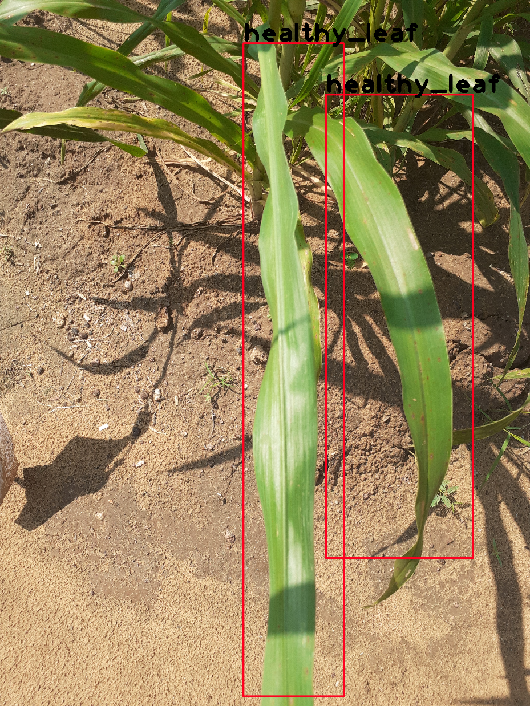
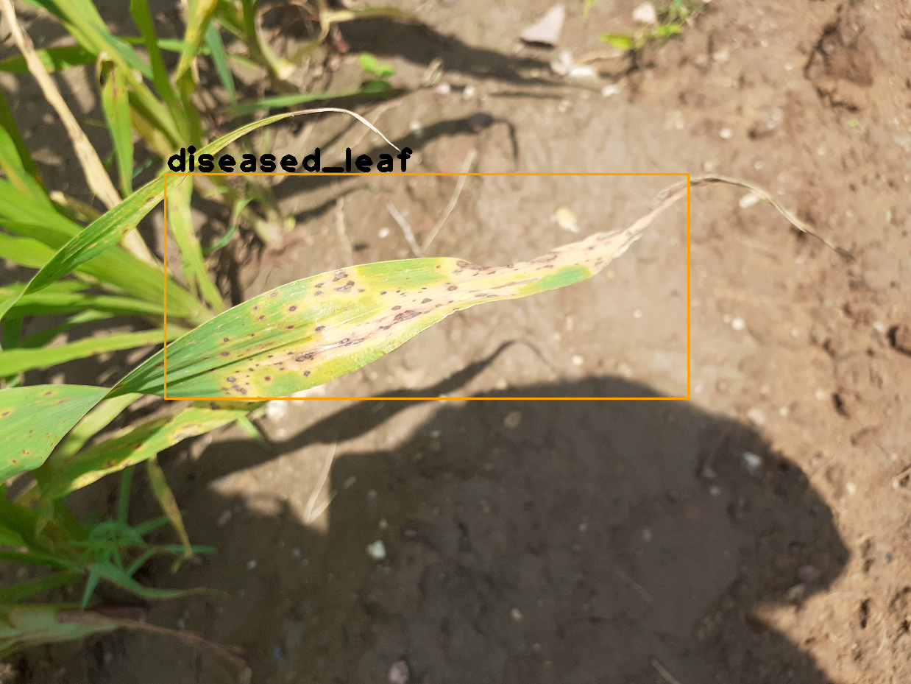
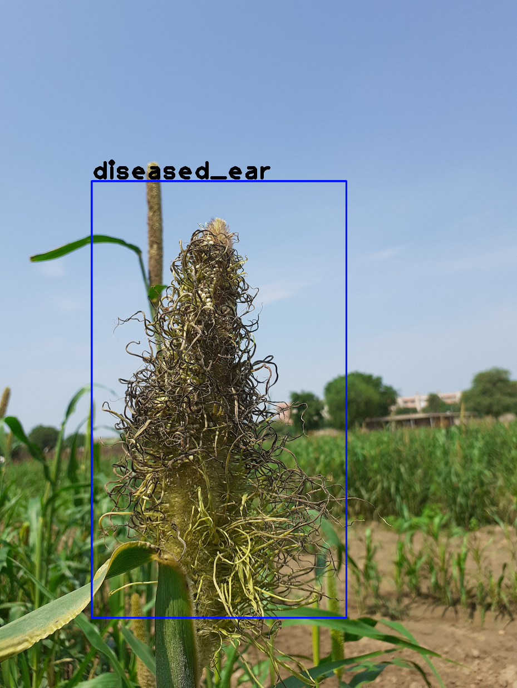
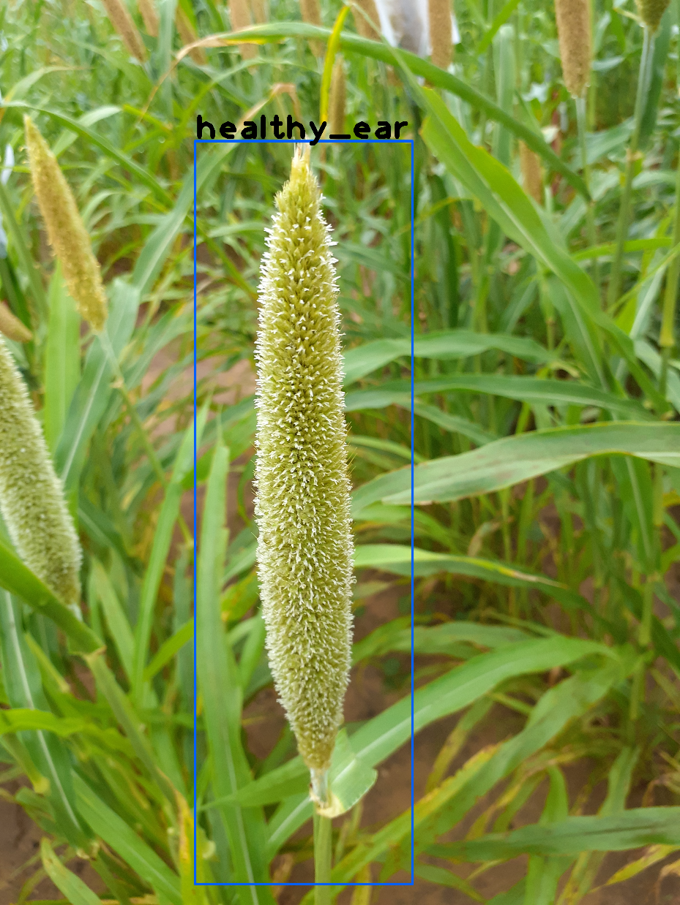

# AI Plant Disease Detection

This repository contains my work on image-based downy mildew detection in pearl millets using deep learning techniques.  
Commonly known as Bajra, pearl millets are a staple diet for many people in India. Efficient and timely detection of this disease can help increase the crop yield and help the farmers.  
Specifically YOLOv3 and SSD object detectors have been utilized and a comparative analysis of their performance conducted.  
Images have been manually collected and annotated.

## Sample ground truth images 

<table>
  <tr>
    <td></td>
    <td></td>
  </tr>
    <tr>
    <td></td>
    <td></td>
  </tr>
 </table>

 

## Dataset Distribution

|    Type   | #Leaves        |     #Ears      | 
|:-----------:| :-------------: | :-------------: |
|  <b>Healthy  | 235  | 238  |
|  <b>Diseased | 200  | 113  |

## Test-Set Results

Coming Soon !